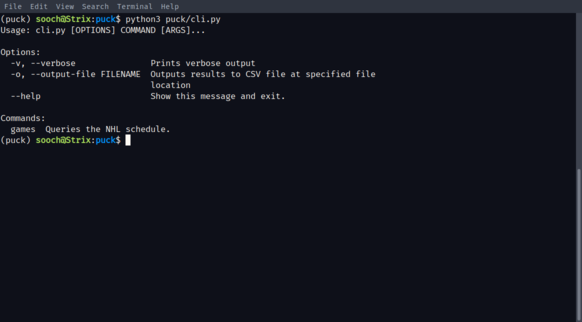
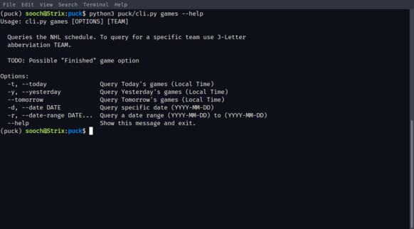
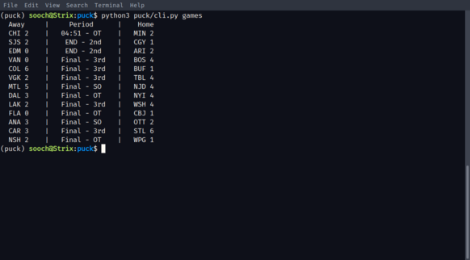
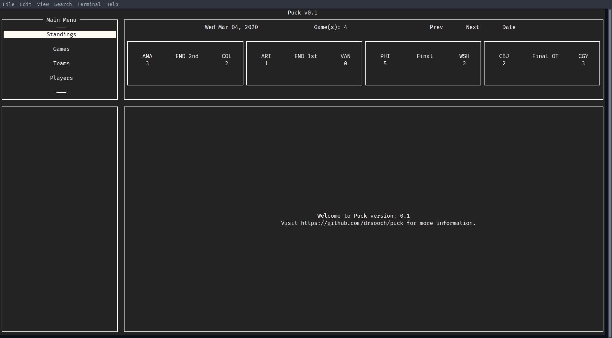
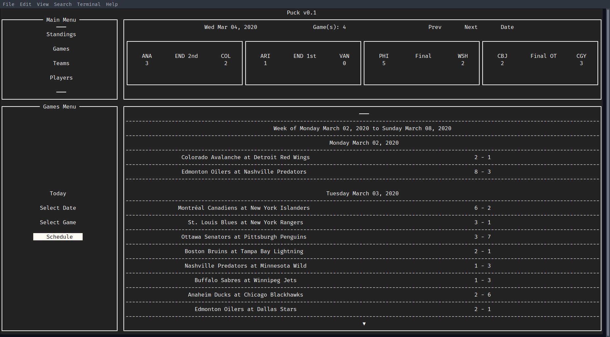
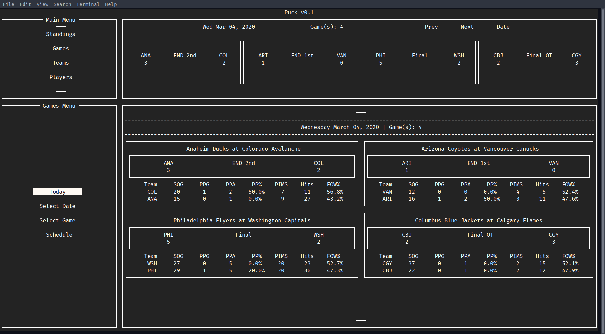

# Puck
Puck the NHL CLI and TUI.
***
# Current Status:
Version 0.1 is being pushed to the repository. (Quite an arbitrary version number I know.) Part of the reasoning behind this is to expose my code to the outside world. Features are slowly being evolved, unfortunately a new semester has started and I have to stay on top of my impending workload.

## CLI:
The CLI interface is barebones. Currently only one subcommand is implemented: games.

The main options are also not workable (-v and -o). I decided to make a TUI before I could iterate further on the CLI.

Using the games subcommand is straightforward:

Selecting the option simply prints out the selected time frames games.

> **NOTE:** While writing this README, I realized I didn't fully implement the date range command.
> It will print out all the games with no delineation between them. **WOO!**

## TUI
The actual TUI has its framework pretty set in stone. Unfortunately, I struggled with wrangling Urwid framework to conform to the Terminals size. In its current state sizing has slowly been worked into the code. As it stands, width is adaptive (somewhat). Please let me know if you run into any issues with sizing let me know! (all 2 of you reading this)

The Games menu option is currently the only one available. You can drill down into the box scores for past games and look at the upcoming schedule. Single Game boxscores are on their way. The most recent commit will require database set up (see below). When selecting an individual game, you won't be greeted with anything useful. In the event anyone is using this thing, let me know if you run into any issues with single game boxscores.

There's not much else you can do besides look at today's games. You can use the date selector to take a peek at other days. As mentioned previously, sizing is off so in instances where there are not many games the sizing will look absurd...

The TUI now uses an SQLite3 database internall, in order to track players. Attempting to query a full teams roster would take exceptionally long, multiply that one team by the amount of team's playing, and you run into a lot of issues. The database also removes any issues if a connection error was undergone when querying these players.

## Install and Run

Create a Python virtual environment (3.7>)

`python3 -m venv venv_dir`

If for whatever reason you actually want to take the time to download and use this thing. Clone this repo.

`git clone https://github.com/drsooch/puck.git`

Place the source files in under a directory in `venv_dir` whatever that may be.

Install any required modules.

`pip3 install -r requirements.txt`

The postgresql database MUST be created by you. I have not been able to make it work through using the subprocess module. The createdb command was giving me too much grief. Instead, you must create a database with whatever name you want and preferably under a ROLE that does not require authentication. There is a simple setup script to link the config, database and user together. Run `python3 puck_install.py` and follow the prompts. This is where you will enter the database name and database user name.

There is an SQL dump file provided. This has all of the needed data to get Puck to work. Pipe this file into your created database: `psql myDB < puck_dump.sql`.

**IF YOU WANT UP TO DATE STATS**: You can run puck through its normal route and download the data. The data downloaded consists of players, teams, season stats for both players and teams. It's imperative that you have a solid internet connection before first start up. If there is an exception during initialization, delete the database file and run it again. It can take several minutes for setup to complete. I would recommend running it in a side terminal and leaving it in the background.

To actually run it.

`python3 puck/__main__.py`

The `__main__.py` file will be the eventual executable. It currently only opens the TUI app, change the `if True:` to `False` to get the CLI

Wait what's that? Python failed to import puck.whatever? This happened more times than I can count. My best answer, until I clean up the code,is to play with the import paths until one works.

## Final Notes:

If you see code that "smells" or could be implemented differently, please don't hesitate to let me know. I'm always open to suggestions and critiques!

The code has a mix of docstrings and no docstrings. I haven't found the time to go through and create docstringsfor functions and classes yet. Please bear  with me while I continue to work on this in my spare time. Also the test folder is empty... Because who needs testing......

### Copyright:
NHL and the NHL Shield are registered trademarks of the National Hockey League. NHL and NHL team marks are the property of the NHL and its teams. © NHL 2020. All Rights Reserved.