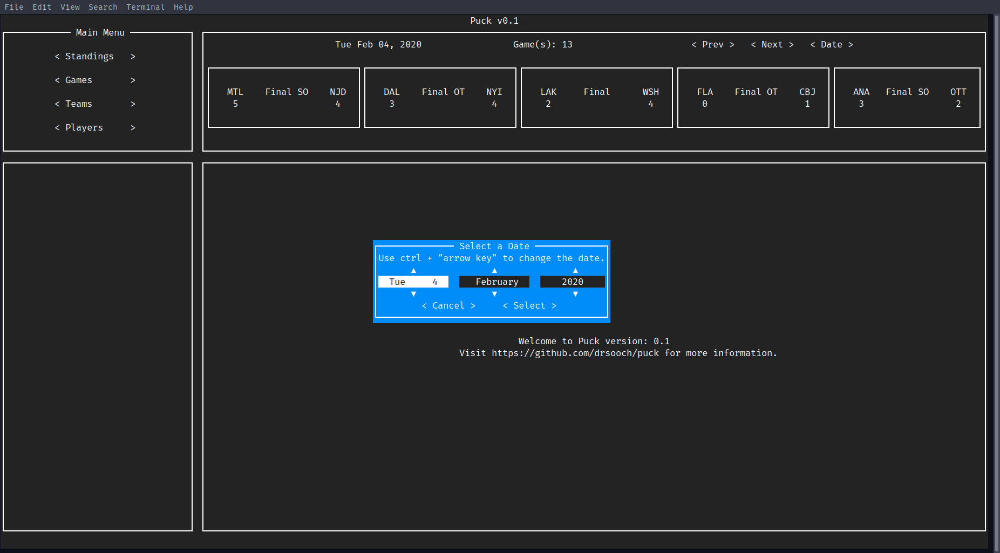

# Puck
Puck the NHL CLI and TUI.
***
# Current Status:
Version 0.1 is being pushed to the repository. (Quite an arbitrary version number I know.)
Part of the reasoning behind this is to expose my code to the outside world.
Features are slowly being evolved, unfortunately a new semester has started and I have to
stay on top of my impending workload. 

## CLI:
The CLI interface is barebones. Currently only one subcommand is implemented: games.

The main options are also not workable (-v and -o). I decided to make a TUI before I could
iterate further on the CLI.

Using the games subcommand is straightforward:

Selecting the option simply prints out the selected time frames games.

> **NOTE:** While writing this README, I realized I didn't fully implement the date range command. 
> It will print out all the games with no delineation between them. **WOO!**

## TUI
The actual TUI has its framework pretty set in stone. Unfortunately, I struggled with
wrangling Urwid framework to conform to the Terminals size. In its current state a lot of 
sizing is hardcoded to fit in a full-screen terminal. Please let me know if you run into any
issues with sizing let me know! (all 2 of you reading this)

There's not much else you can do besides look at today's games. You can use the date selector to take a peek at other days. 
As mentioned previously, sizing is off so in instances where there are not many games the sizing will look absurd...

**Note:** Yes the color of the date box is gross. It's for testing purposes :).

## Install and Run

If for whatever reason you actually want to take the time to download and use this thing. Clone this repo.

`git clone https://github.com/drsooch/puck.git`

Create a Python virtual environment (3.7>)

`python3 -m venv venv_dir`

Place the source files in `venv_dir` whatever that may be.

Install any required modules

`pip3 install -r requirements.txt`

Finally, run it.

`python3 puck/tui/app.py`

or

`python3 puck/cli.py`

Wait what's that? Python failed to import puck.whatever? 
This happened more times than I can count. My best answer, until I clean up the code,
is to play with the import paths until one works. 

## Final Notes:

The code has a mix of docstrings and no docstrings. I haven't found the time to go through and create docstrings 
for functions and classes yet. Please bear with me while I continue to work on this in my spare time.
Also the test folder is empty... Because who needs testing......